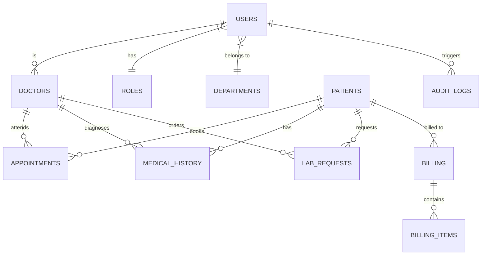

# Hospital Management System (HMS) — Enterprise Operational Platform

[](https://nodejs.org/)
[](https://expressjs.com/)
[-orange.svg)](https://sqlite.org/)
[](https://getbootstrap.com/)
[]()

> A full-featured, secure, and enterprise-grade Hospital Management System built using **Node.js**, **Express.js**, **EJS Templating**, **Bootstrap 5.3**, and **SQLite**. Designed to streamline hospital administrative workflows, patient clinical care, doctor scheduling, laboratory diagnostics, pharmacy inventory control, and itemized billing receipts with strict security compliance and server-side validation.

---

## 📋 Table of Contents
1. [Key Features & Core Modules](#-key-features--core-modules)
2. [Technology Stack](#-technology-stack)
3. [System Architecture](#-system-architecture)
4. [Database Schema & ER Design](#-database-schema--er-design)
5. [Role-Based Access Control (RBAC) & Security](#-role-based-access-control-rbac--security)
6. [Server-Side Input Validation](#-server-side-input-validation)
7. [Installation & Quick Start](#-installation--quick-start)
8. [Default User Credentials](#-default-user-credentials)
9. [Academic & Evaluation Verification](#-academic--evaluation-verification)

---

## 🚀 Key Features & Core Modules

### 1. Patient Management & Directory
* **Patient Unique Identification (UID):** Automated generation of immutable patient identifiers (`PAT-YYYY-XXXX`).
* **Demographics & Emergency Contacts:** Complete personal profiling including DOB, gender, blood group, address, NIC number, phone number, emergency contact details, and medical allergy notes.
* **Strict Format Validation:** NIC format validation (old 9 digits + 'V/v' or new 12 digits) and phone number validation (10 digits with optional `+94` Sri Lanka prefix).
* **Directory Search & Search Filters:** Real-time search across patient name, UID, NIC, and city.

### 2. Doctor Management & Department Scheduling
* **Specialist Profiling:** Doctor registration linked to hospital departments (Cardiology, Neurology, Pediatrics, General Surgery, Orthopedics, etc.).
* **Consultation Fee & Availability:** Configurable consultation fees, room assignments, weekly availability schedules, and active status toggling.
* **Doctor Directory & Profile Views:** Comprehensive view of assigned patient appointments and historical treatment logs.

### 3. Appointment Scheduling & Management
* **Booking Engine:** Appointment creation (`APT-YYYY-XXXX`) linking registered patients to specialists with date and time slot selection.
* **Conflict Prevention:** Server-side validation guarding against double-booking doctor slots.
* **Status Workflow:** Lifecycle management (`Scheduled`, `In Progress`, `Completed`, `Cancelled`) and rescheduling interface.
* **Calendar & Schedule Grid View:** Visual appointment grid organizing daily doctor consultations.

### 4. Electronic Medical Records (EMR)
* **Clinical Examination Records:** Detailed diagnosis tracking, presenting symptoms, treatment care plans, and doctor notes.
* **Vital Signs Monitoring:** Recording of Blood Pressure (mmHg), Pulse Rate (BPM), Body Temperature (°F), and Body Weight (kg).
* **Prescription Rx Generator:** Structured medication dosing and administration instructions.
* **Printable Clinical Case Sheets:** Formal, printable medical history sheets for patient records.

### 5. Laboratory Diagnostic Management
* **Lab Test Orders:** Diagnostic request generation (`LAB-YYYY-XXXX`) tagged by department (Hematology, Biochemistry, Microbiology, Radiology, Pathology).
* **Sample & Workflow Tracking:** Real-time progression tracking (`Pending` -> `In Progress` -> `Completed`).
* **Diagnostic Results Logging:** Detailed entry of test parameters, reference ranges, and technician observations with printable lab report output.

### 6. Pharmacy Management & Stock Inventory
* **Inventory Control:** Complete drug catalog with medicine codes (`MED-XXX`), generic names, categories, unit prices, manufacturer details, and batch expiry dates.
* **Stock Alert Warnings:** Automatic visual warning badges for **Low Stock** (quantity $\le$ reorder threshold) and **Expiring Soon** (within 60 days).
* **Prescription Dispensation:** Automated stock deduction upon prescription fulfillment.

### 7. Itemized Billing System & Receipts
* **Invoice Generation:** Automatic invoice creation (`INV-YYYY-XXXX`) aggregating doctor consultation fees, lab diagnostic charges, pharmacy prescriptions, and custom services.
* **Financial Metrics:** Automated calculation of Gross Subtotal, Discount, Net Payable Amount, and Paid Amount.
* **Payment Processing:** Payment recording (Cash, Card, Bank Transfer, Insurance Claim) supporting `Paid`, `Partially Paid`, and `Unpaid` statuses.
* **Printable Official Receipts:** Enterprise receipt layout compliant with hospital billing standards, including cashier signature block.

### 8. Audit Logging & System Compliance
* **Action Auditing:** Automated logging of all critical actions (User login, Patient creation/edits, EMR entries, Lab status updates, Inventory changes, and Invoice payments).
* **Metadata Recording:** Capture of User ID, IP Address, Action Type, Entity ID, Details, and **Sri Lanka Standard Time (Asia/Colombo)** timestamps.

---

## 🛠️ Technology Stack

* **Backend Engine:** Node.js (v18+) & Express.js (v4.18)
* **View Engine:** EJS Templating with `express-ejs-layouts`
* **Database:** SQLite running in-memory/file via `sql.js`
* **Styling & UI:** Vanilla CSS & Bootstrap 5.3 (Locally hosted, zero external CDN dependency)
* **Icons:** Bootstrap Icons 1.11 (Locally hosted)
* **Security & Auth:** `bcryptjs` for password hashing & `express-session` for RBAC session management
* **Input Validation:** `express-validator` for server-side form verification

---

## 📂 System Architecture

```
Hospital-Management-System/
├── database/
│   ├── schema.sql              # Database DDL schema (Tables, Indexes, Seed Data)
│   ├── db.js                  # Database connection wrapper (sql.js wrapper & helper functions)
│   └── init.js                # Database initialization & seeding script
├── middleware/
│   └── auth.js                # RBAC authorization & session guards
├── public/
│   ├── css/
│   │   ├── bootstrap.min.css  # Local Bootstrap 5.3 CSS
│   │   └── style.css          # Custom theme styles & micro-animations
│   └── js/
│       └── bootstrap.bundle.min.js
├── routes/
│   ├── auth.js                # Login, Logout & Authentication handlers
│   ├── patients.js            # Patient Management CRUD routes
│   ├── doctors.js             # Doctor Management CRUD routes
│   ├── appointments.js        # Appointment Booking & Rescheduling routes
│   ├── emr.js                 # Electronic Medical Records (EMR) routes
│   ├── laboratory.js          # Laboratory Test Orders & Results routes
│   ├── pharmacy.js            # Pharmacy Inventory & Dispensing routes
│   └── billing.js             # Billing System & Itemized Invoicing routes
├── views/
│   ├── layout.ejs             # Master layout template (Sidebar, Topbar, Flash messages)
│   ├── dashboard.ejs          # Analytics Dashboard with KPI metrics & audit feed
│   ├── patients/              # Patient EJS view templates
│   ├── doctors/               # Doctor EJS view templates
│   ├── appointments/          # Appointment EJS view templates
│   ├── emr/                   # EMR EJS view templates
│   ├── laboratory/            # Laboratory EJS view templates
│   ├── pharmacy/              # Pharmacy EJS view templates
│   └── billing/               # Billing EJS view templates
├── data/
│   └── hms.db                 # SQLite Database binary storage file
├── server.js                  # Application entry point & Express server config
└── package.json               # Dependencies & scripts configuration
```

---

## 🗄️ Database Schema & ER Design

The database schema comprises **12 relational tables**:



### Table Definitions Summary:
1. `roles`: User permission levels (`Administrator`, `Doctor`, `Nurse`, `Pharmacist`, `Lab Technician`, `Receptionist`, `Cashier`).
2. `departments`: Hospital clinical units (`Administration`, `Cardiology`, `Neurology`, `Pediatrics`, `Orthopedics`, etc.).
3. `users`: Credentials, full names, hashed passwords, contact details, and role FKs.
4. `patients`: Core demographical records, `patient_uid`, NIC, allergies, and emergency contact details.
5. `doctors`: Medical credentials, specialization, consultation fees, and schedule strings.
6. `appointments`: Booking entries with `appointment_number`, status, date, time slot, and reason.
7. `medical_history`: EMR clinical diagnoses, symptoms, vitals, prescriptions, and doctor notes.
8. `lab_requests`: Diagnostic requests with `request_number`, category, status, and result summaries.
9. `medicines`: Pharmacy inventory with drug codes, stock quantities, unit prices, reorder levels, and expiry dates.
10. `billing`: Invoices with `invoice_number`, subtotal, discount, net payable, paid amount, and payment status.
11. `billing_items`: Itemized line items linked to invoices.
12. `audit_logs`: System security audit trail.

---

## 🔒 Role-Based Access Control (RBAC) & Security

The system enforces multi-level security guards using custom Express middleware:
* **Session Guards (`isAuthenticated`):** Restricts unauthenticated access to system routes.
* **Role Enforcement (`authorize(...)`):** Restricts route execution based on user roles (e.g., Pharmacy management accessible to Pharmacists and Administrators; Billing accessible to Cashiers, Accountants, and Administrators).
* **Password Hashing:** `bcryptjs` with salt rounds (10) for secure storage.
* **XSS & Injection Protection:** Query parameterization used across all SQL execution queries (`queryAll`, `queryOne`, `execute`).

---

## 🧪 Server-Side Input Validation

All incoming form POST requests undergo strict validation via `express-validator`:

| Field | Validation Rules | Error Behavior |
| :--- | :--- | :--- |
| **National Identity Card (NIC)** | Must follow 9 digits + 'V/v' (e.g., `123456789V`) or 12 digits (e.g., `198516700123`) | Form re-renders with error flash message |
| **Phone Number** | Must strictly contain 10 digits; allows optional `+94` prefix (e.g., `+94719876543` or `0719876543`) | Form re-renders with error flash message |
| **Consultation / Item Fee** | Positive numeric float ($> 0.00$) | Re-renders form with numeric warning |
| **Pulse Rate / Temp / Weight** | Logical numeric range checks (e.g., Temp: $90 - 110$ °F, Pulse: $30 - 250$ BPM) | Re-renders form with vital signs warning |

---

## ⚙️ Installation & Quick Start

### Prerequisites
* **Node.js** (v18.0.0 or higher)
* **npm** (v9.0.0 or higher)

### Setup Instructions

1. **Clone the Repository:**
   ```bash
   git clone https://github.com/asanjalee/Hospital-Management-System.git
   cd Hospital-Management-System
   ```

2. **Install Dependencies:**
   ```bash
   npm install
   ```

3. **Initialize & Seed the Database:**
   ```bash
   npm run init-db
   ```
   *(Creates schema and seeds initial sample records for Patients, Doctors, Appointments, EMR, Medicines, Lab Requests, and Invoices)*

4. **Start Development Server:**
   ```bash
   npm run dev
   # or
   npm start
   ```

5. **Access Application:**
   Open your browser and navigate to `http://localhost:3000`

---

## 🔑 Default User Credentials

For evaluation and testing purposes, use the following pre-seeded administrative credentials:

* **Username:** `admin`
* **Password:** `admin123`
* **Role:** System Administrator

*(Additional test accounts for Doctors e.g. `dr.smith`, `dr.sarah`, `dr.ruwan` also use password `admin123`)*

---

## 🏆 Academic & Evaluation Verification

* **Design Aesthetics:** Dark navigation sidebar with dynamic blue gradient header banners, responsive Bootstrap 5.3 grids, color-coded status badges, and subtle micro-animations.
* **Data Integrity:** Cascading foreign key enforcement, parameterized SQL query execution, and unique identifier generation across all hospital operational modules.
* **Audit Compliance:** All system state modifications are tracked in real-time with Asia/Colombo timestamps.

---
*Developed for SLT Academic Evaluation.*
